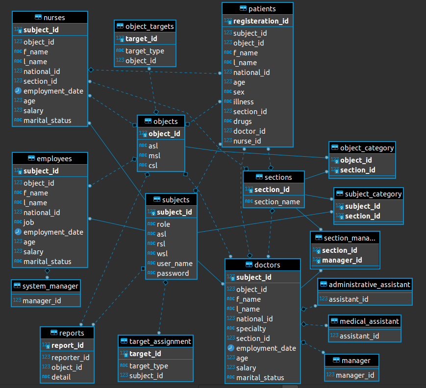
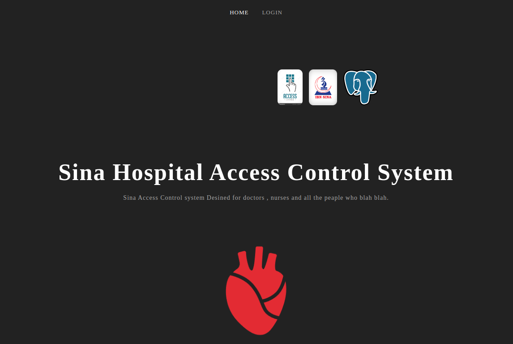
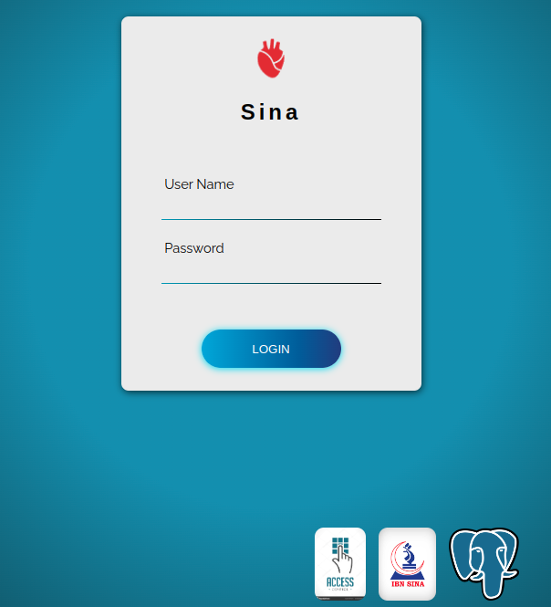
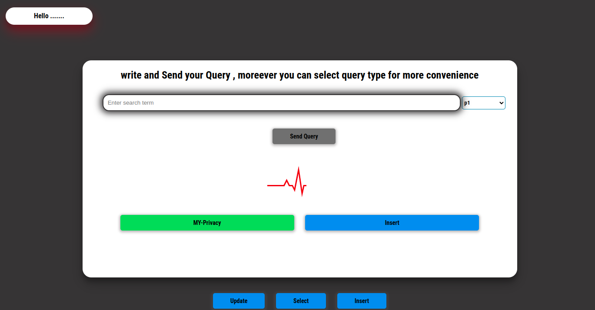

# DB-Access-Controll-System
The **DB-Access-Control-System** is a web-based application designed to simulate **Mandatory Access Control (MAC)** within a hospital environment. It ensures secure access to patient data based on predefined roles and policies. The system uses a frontend built with **jQuery and HTML5**, and a backend powered by **Django** with **PostgreSQL**, implementing robust authentication and authorization mechanisms. 

## Features
- Role-based access control (RBAC) for different hospital staff.
- Secure login and verification mechanism.
- Query handling via PostgreSQL with MAC policy enforcement.
- User-friendly interface with responsive design.

## Technologies Used
- **Frontend:** HTML5, CSS, jQuery
- **Backend:** Django (Python), PostgreSQL
- **Authentication:** Django authentication system
- **Deployment:** Works on local and cloud environments

you can see a schema of databse used in this project: 

  

  
After logging into the access control system, users will be verified by their username and assigned roles based on their ID and role domain within the hospital

  

  

  

  

Each user can then make a query, which is executed based on the Mandatory Access Control (MAC) policy. This ensures that the MAC policy is not violated after the execution of the query

  

## Developed by contributors:

